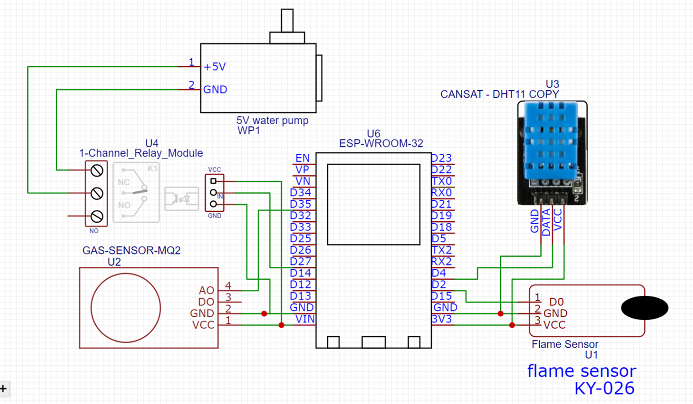
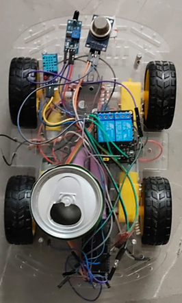
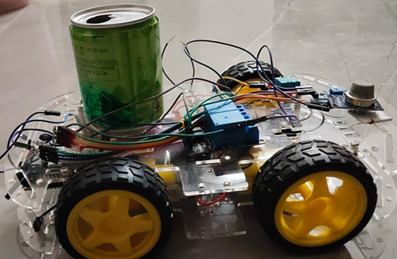
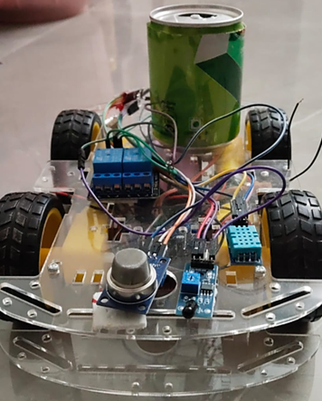

# AUTOMATIC-FIRE-SYSTEM-PROJECT
IoT-based automatic fire detection and extinguishing system using ESP32 with real-time monitoring, sensor integration, and automated response
# 🔥 Auto Fire Detection and Extinguishing System

---

## 📌 Overview
This project presents an **IoT-based automatic fire detection and extinguishing system** using ESP32.  
The system detects fire conditions using sensors and **automatically activates a response mechanism** to control the fire.

---

## 🎯 Objectives
- Detect fire and hazardous gas conditions  
- Provide automatic response using actuators  
- Ensure real-time monitoring and safety  

---

## 🧰 Components Used
- ESP32 Microcontroller  
- MQ-2 Gas Sensor  
- Flame Sensor  
- DHT11 Temperature Sensor  
- Servo Motor / Water Pump  
- Buzzer  

---

## ⚙️ Working Principle
- Sensors continuously monitor environmental conditions  
- If fire/gas is detected:
  - Buzzer is activated  
  - Water pump/servo is triggered  
- System responds automatically without human intervention  

---

## 🔌 Circuit Diagram

---

## 🖼️ Hardware Implementation

### 🔹 Top View

### 🔹 Side View

### 🔹 Front View

---

## 🎥 Working Demo
▶️ [Click here to watch the working video](project_working_video.mp4)

---

## 📘 Project Report
📄 [View Full Report](AUTOMATIC_FIRE_SYSTEM_PROJECT_REPORT.pdf)

---

## 💻 Software
- Arduino IDE  
- Embedded C/C++  

---

## 🧠 Key Learnings
- Sensor interfacing with ESP32  
- Real-time embedded system design  
- IoT-based automation concepts  
- Hardware-software integration  
- Debugging and system optimization  

---

## 🚀 Future Scope
- Mobile app integration for remote monitoring  
- Cloud-based alert system  
- AI-based fire prediction  
- Industrial-level safety system  

---

## 👨‍💻 Author
**K L V N Rajkumar**  
VLSI & Embedded Systems Enthusiast  

---

## ⭐ Support
If you like this project, give it a ⭐ on GitHub!
